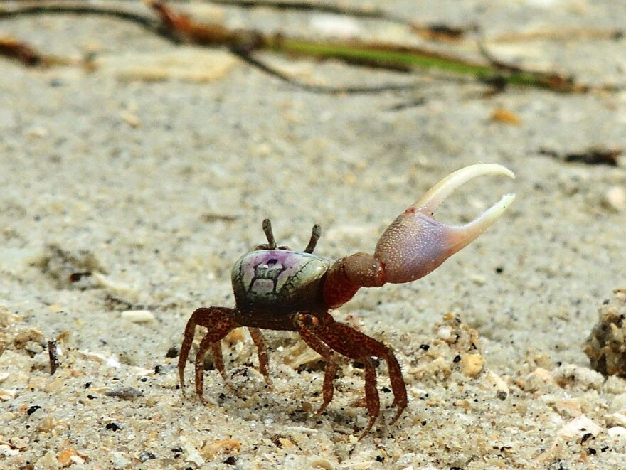
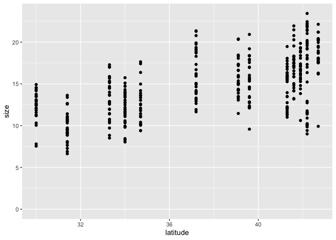
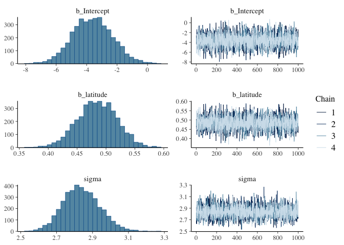
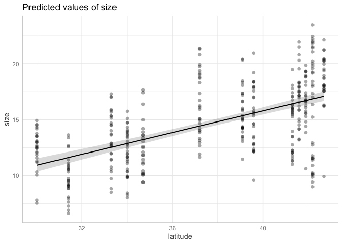
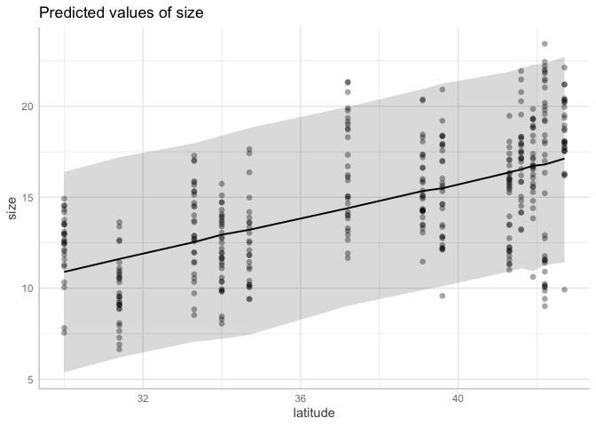

Activity 9: Statistical reasoning 1: intro to models
================

Welcome! This is the first statistical reasoning activity. We will learn
how to implement basic bayesian models using the `brms` package.

------------------------------------------------------------------------

You will submit one output for this activity:

1.  A **PDF** of a rendered Quarto document with all of your R code.
    Please create a new Quarto document (e.g. don’t use this
    `README.qmd`), include all of the code that appears in this
    document, in addition to adding your own code and **answers to all
    of the questions** in the “Q#” sections. Submit this through
    Gradescope.

*If you have trouble submitting as a PDF, please ask Calvin or Malin for
help. If we still can’t solve it, you can submit the .qmd file instead.*

A reminder: **Please label the code** in your final submission in two
ways: 1) denote your answers to each question using headers that
correspond to the question you’re answering and 2) thoroughly “comment”
your code: remember, this means annotating your code directly by typing
descriptions of what each line does after a `#`. This will help future
you!

------------------------------------------------------------------------

Let’s start by reading in the relevant packages

``` r
library(brms) # for statistics
library(tidyverse)
library(ggeffects) # for the prediction plot
library(lterdatasampler) # for built-in datasets
```

------------------------------------------------------------------------

# 1. Fiddler crabs



The data today is fiddler crab size data from 13 salt marshes from
Florida to Massachusetts. Crab size was measured as carapace width in
mm. Air and water temperature data from nearby monitoring programs are
also included in Celsius.

``` r
head(pie_crab)
```

    # A tibble: 6 × 9
      date       latitude site   size air_temp air_temp_sd water_temp water_temp_sd
      <date>        <dbl> <chr> <dbl>    <dbl>       <dbl>      <dbl>         <dbl>
    1 2016-07-24       30 GTM    12.4     21.8        6.39       24.5          6.12
    2 2016-07-24       30 GTM    14.2     21.8        6.39       24.5          6.12
    3 2016-07-24       30 GTM    14.5     21.8        6.39       24.5          6.12
    4 2016-07-24       30 GTM    12.9     21.8        6.39       24.5          6.12
    5 2016-07-24       30 GTM    12.4     21.8        6.39       24.5          6.12
    6 2016-07-24       30 GTM    13.0     21.8        6.39       24.5          6.12
    # ℹ 1 more variable: name <chr>

------------------------------------------------------------------------

## 1.1 Plot data, pick the model

The first step is to graph our data so we can have a visual sense of
what’s going on. Let’s say that our ultimate goal is to understand
whether the size of crabs changes with latitude in a test of Bergmann’s
rule:

> “One of the best-known patterns in biogeography is Bergmann’s rule. It
> predicts that organisms at higher latitudes are larger than ones at
> lower latitudes. Many organisms follow Bergmann’s rule, including
> insects, birds, snakes, marine invertebrates, and terrestrial and
> marine mammals. What drives Bergmann’s rule? Bergmann originally
> hypothesized that the organisms he studied, birds, were larger in the
> colder, higher latitudes due to heat-conservation. But the
> heat-conservation hypothesis relies on internal regulation of body
> temperature and therefore does not apply to ectotherms, some of which
> also follow Bergmann’s rule. There is likely no universal mechanism
> underpinning Bergmann’s rule, regardless of ecto- or endothermy. As a
> result, other mechanisms have been proposed to explain Bergmann’s
> rule, including the starvation-resistant hypothesis, the diet-quality
> hypothesis, the enemy hypothesis, the resource rule, seasonality
> hypothesis, and the temperature–size rule (Johnson et al., 2019).”

To start, let’s plot our response variable carapace width (`size`) on
the y axis with our predictor variable `latitude` on the x axis.

``` r
pie_crab %>% 
  ggplot(aes(x = latitude, y = size)) +
  geom_point() +
  # Make the y-axis include 0
  ylim(0, NA)
```



------------------------------------------------------------------------

### Q1.1 Interpret the graph

Interpret this graph in 1-2 sentences: Does it look like size increases
with latitude? Describe how confident you are in this interpretation.

------------------------------------------------------------------------

### Q1.2 Beautify this graph

Make this graph look a bit nicer! Use the skills you learned earlier in
the quarter.

------------------------------------------------------------------------

Now that you’ve spent some time pondering the data, let’s put together
our first model. From lecture, linear models follow the equation:

$y = intercept + slope*x$

Let’s set up our model to look like:

$size = intercept + slope*latitude$

------------------------------------------------------------------------

## 1.2 Fit linear regression with `brms`

------------------------------------------------------------------------

Time to run the model! We will be using the `brm()` function. There’s a
lot here, so let’s dig in line-by-line:

``` r
# latitude model
m.crab.lat <- 
  brm(data = pie_crab, # Give the model the pie_crab data
      # Choose a gaussian (normal) distribution
      family = gaussian,
      # Specify the model here. 
      size ~ latitude,
      # Here's where you specify parameters for executing the Markov chains
      # We're using similar to the defaults, except we set cores to 4 so the analysis runs faster than the default of 1
      iter = 2000, warmup = 1000, chains = 4, cores = 4,
      # Setting the "seed" determines which random numbers will get sampled.
      # In this case, it makes the randomness of the Markov chain runs reproducible 
      # (so that both of us get the exact same results when running the model)
      seed = 4,
      # Save the fitted model object as output - helpful for reloading in the output later
      file = "output/m.crab.lat")
```

### Q1.3 What does the “iter” argument do?

Navigate to the `brm` help page to answer: What does the `iter =`
argument do?

------------------------------------------------------------------------

## 1.3 Assess model

First, we need to assess whether or not our model actually ran
correctly. Let’s print a summary of the model output:

``` r
summary(m.crab.lat)
```

     Family: gaussian 
      Links: mu = identity 
    Formula: size ~ latitude 
       Data: pie_crab (Number of observations: 392) 
      Draws: 4 chains, each with iter = 2000; warmup = 1000; thin = 1;
             total post-warmup draws = 4000

    Regression Coefficients:
              Estimate Est.Error l-95% CI u-95% CI Rhat Bulk_ESS Tail_ESS
    Intercept    -3.61      1.30    -6.09    -1.01 1.00     4116     3192
    latitude      0.48      0.03     0.42     0.55 1.00     4108     3140

    Further Distributional Parameters:
          Estimate Est.Error l-95% CI u-95% CI Rhat Bulk_ESS Tail_ESS
    sigma     2.84      0.10     2.65     3.04 1.00     3758     2852

    Draws were sampled using sampling(NUTS). For each parameter, Bulk_ESS
    and Tail_ESS are effective sample size measures, and Rhat is the potential
    scale reduction factor on split chains (at convergence, Rhat = 1).

We do this in part by looking at the `Rhat` (R hat) column, which should
be very close to 1. If you remember from lecture, this model runs
multiple chains that converge on estimates for the slope and the
intercept. An R hat of 1 tells us that those four chains converged on
the same estimate. This looks fine for us!

Let’s also look at the chains and the “posterior distributions” in a
graph.

``` r
plot(m.crab.lat) # show posteriors and chains
```



We’re looking for three things:

1.  Are the posterior samples on the left each a smooth distribution,
    with one clean peak, or do they have multiple clear peaks? The
    latter is a bad sign. They look good in this case.
2.  Are the four chains on the overlapping each other, or are they
    clearly separate? The latter is a bad sign. We again look good in
    this case.
3.  Are the four chains flat, or is there a clear trend up or down? The
    latter is a bad sign. We again look good in this case.

If we fail any of these tests, we would want to try running the MCMC
chain with more iterations. We may also need to think hard about whether
our model is correctly designed.

------------------------------------------------------------------------

## 1.4 Interpret model

Now that we feel good that the model fit correctly, let’s look at a
summary table of our model’s output.

``` r
summary(m.crab.lat)
```

     Family: gaussian 
      Links: mu = identity 
    Formula: size ~ latitude 
       Data: pie_crab (Number of observations: 392) 
      Draws: 4 chains, each with iter = 2000; warmup = 1000; thin = 1;
             total post-warmup draws = 4000

    Regression Coefficients:
              Estimate Est.Error l-95% CI u-95% CI Rhat Bulk_ESS Tail_ESS
    Intercept    -3.61      1.30    -6.09    -1.01 1.00     4116     3192
    latitude      0.48      0.03     0.42     0.55 1.00     4108     3140

    Further Distributional Parameters:
          Estimate Est.Error l-95% CI u-95% CI Rhat Bulk_ESS Tail_ESS
    sigma     2.84      0.10     2.65     3.04 1.00     3758     2852

    Draws were sampled using sampling(NUTS). For each parameter, Bulk_ESS
    and Tail_ESS are effective sample size measures, and Rhat is the potential
    scale reduction factor on split chains (at convergence, Rhat = 1).

The output reminds us of our model formula that we chose
(`size ~ latitude`). Most important to answering our question are the
parameter estimates in the `estimate` column. Remember, our model was
$size = intercept + slope*latitude$. The `slope` parameter is going to
tell us what the effect of latitude is. For every one unit change of
latitude, what is the effect on size? We need to translate that
interpretation to the units that those variables represent: the slope
value is thus *for every one degree of latitude, carapace size changes
this much in millimeters*.

Looking at our table, we see the estimate for `latitude` is 0.48: This
indicates that the model estimated that for every 1 degree latitude,
carapace width increases by 0.48 mm.

------------------------------------------------------------------------

Earlier you were asked to “*describe how confident you are in this
interpretation*” when qualitatively interpreting the graph of `size` vs
`latitude`. Now, let’s answer this quantitatively by examining how much
confidence the model has in the size-latitude association. Are only
positive (non-zero) slopes compatible with the data? Or would a flat
(slope of zero) association also be compatible? If a slope of zero is
compatible with the data, then we can’t really say that our predictor
(latitude) has any effect on our response (size).

To assess this, we can look at the lower and upper 95% Credible Interval
columns (`l-95% CI` and `u-95% CI`, respectively) and see if that
interval range intersects with zero. We can see that our slope estimate
(the estimate of `latitude`) ranges from 0.42 to 0.55 - zero is not
included in this range. Therefore, we can reasonably conclude here that,
given our model, the effect of latitude on body size has a 95% chance of
being between those values, and importantly, NOT zero!

------------------------------------------------------------------------

In the results section of a paper, we would write something along these
lines:

*We found that crab size increased with latitude, with an increase of
0.48mm of carapace width per 1 degree of latitude. Our 95% credible
intervals were between 0.42 and 0.55 mm/degree, suggesting that given
our model, the effect of latitude on carapace width is different from
zero.*

------------------------------------------------------------------------

### Bonus

Let’s calculate the probability of a zero slope! The MCMC chains are big
columns of samples from the posterior distribution, so we can add up the
proportion of slope estimates that are zero or lower.

``` r
as_draws_df(m.crab.lat)  %>%  # extract the posterior samples from the model estimate
  select(b_latitude)  %>%  # pull out the latitude samples from all 4 chains. we'll get a warning that we can ignore.
  summarize(p_slope_lessthanorequalto_zero = sum(b_latitude <= 0)/length(b_latitude))
```

    # A tibble: 1 × 1
      p_slope_lessthanorequalto_zero
                               <dbl>
    1                              0

Ok! The model reports a zero chance of a slope less than or equal to
zero. Feel free to try other thresholds to explore (e.g., what’s the
probability the slope is greater than 0.5 mm per degree latitude?).

------------------------------------------------------------------------

## 1.5 Plot model on the data

Here we are going to plot the data and the model output in two different
ways:

- **Compatibility interval** shows uncertainty in the average response (the estimate for the slope) 

- **Prediction interval** shows uncertainty in the data around the average response (the estimate for the slope)

``` r
# compatibility interval. the shows uncertainty in the average response.
confm.crab.lat <- predict_response(m.crab.lat)
plot(confm.crab.lat, show_data = TRUE)
```



``` r
# prediction interval. this shows uncertainty in the data around the average response.
confm.crab.lat <- predict_response(m.crab.lat, interval = 'prediction')
plot(confm.crab.lat, show_data = TRUE)
```



------------------------------------------------------------------------

## 1.6 Repeat with a new variable: water temp sd

Let’s repeat this example with a new variable: the water temperature
standard deviation, `water_temp_sd`. The standard deviation (sd) can be
used as a metric of variability: higher sd means higher variability. We
can ask: *is higher variability in water temperature associated with
fiddler crab body size?*

------------------------------------------------------------------------

### Q1.4 Make a hypothesis

*Before* you look at the data, what direction of an effect do you
expect? Do you think higher variability would be associated with larger
or smaller crabs? Why? Please write 1-2 sentences.

------------------------------------------------------------------------

### Q1.5 Graph the data

------------------------------------------------------------------------

### Q1.6 Interpret the graph

Does it look like size changes with the sd of water temperature?
Describe how confident you are in this interpretation.

------------------------------------------------------------------------

### Q1.7 Set up and run this new model

We’ll set up our model to look like:

$size = intercept + slope*watertempsd$

------------------------------------------------------------------------

Keep all of the output the same except for the parts where you
specify 1) the model formula and 2) the `file =` output. Name this new
model `m.crab.watersd` to distinguish it from the latitude model.

------------------------------------------------------------------------

### Q1.8 Assess the model

Assess whether the model ran correctly by looking at R hat, the chains,
and the posterior distributions using the plot() and summary() functions
as below. Describe your thought process about whether the model ran
correctly in 1-2 sentences.

``` r
# show posteriors and chains
plot(m.crab.watersd) 

# show summary, including rhat
summary(m.crab.watersd)
```

------------------------------------------------------------------------

### Q1.9 Interpret the model

Based on the summary output, interpret your model by answering:

1.  What is the effect of your predictor? This information is in the
    `estimate` column to the right of your predictor `water_temp_sd`.
    Remember to describe the effect using the units to make it
    biologically meaningful.
2.  Is the effect reasonably different from zero? In other words, does
    the confidence interval intersect with zero?

``` r
# Show model output
summary(m.crab.watersd)
```

------------------------------------------------------------------------

This is a situation where our predictor variable, `water_temp_sd`, does
not seem to have an effect on the body size of crabs. We would say
something along the lines of: *We found an increase of 0.10mm of
carapace width per 1 unit of the standard deviation of water
temperature, but our 95% credible intervals included zero (-0.20 to
0.40), suggesting that given our model, the effect of water temperature
standard deviation on carapace width is not different from zero.*

------------------------------------------------------------------------

# 2. Back to Pikas!


We can’t stay away from the cute pikas for too long! In this section you
will apply the statistical thinking you’ve learned to the pika dataset
in one of two ways: you will try and see whether or not the stress of
pikas is explained by either 1) elevation or 2) day of year.

Let’s look at the data again

``` r
head(nwt_pikas)
```

    # A tibble: 6 × 8
      date       site      station utm_easting utm_northing sex   concentration_pg_g
      <date>     <fct>     <fct>         <dbl>        <dbl> <fct>              <dbl>
    1 2018-06-08 Cable Ga… Cable …      451373      4432963 male              11563.
    2 2018-06-08 Cable Ga… Cable …      451411      4432985 male              10629.
    3 2018-06-08 Cable Ga… Cable …      451462      4432991 male              10924.
    4 2018-06-13 West Kno… West K…      449317      4434093 male              10414.
    5 2018-06-13 West Kno… West K…      449342      4434141 male              13531.
    6 2018-06-13 West Kno… West K…      449323      4434273 <NA>               7799.
    # ℹ 1 more variable: elev_m <dbl>

Date is one of the columns, but we specifically want “day of year” as a
metric to quantify how late in the season it is. This also allows us to
interpret our model’s output a little more informatively.

We can extract day of year using the `lubridate` package (within
`tidyverse`), which is all about working with dates and times:

``` r
nwt_pikas_doy <- nwt_pikas %>% 
  # Add a new column called day_of_year
  # yday extracts the day of year from the date column
  mutate(day_of_year = yday(date)) %>% 
  # relocate the day_of_year column after the date column
  relocate(day_of_year, .after = date)

head(nwt_pikas_doy)
```

    # A tibble: 6 × 9
      date       day_of_year site       station      utm_easting utm_northing sex  
      <date>           <dbl> <fct>      <fct>              <dbl>        <dbl> <fct>
    1 2018-06-08         159 Cable Gate Cable Gate 1      451373      4432963 male 
    2 2018-06-08         159 Cable Gate Cable Gate 2      451411      4432985 male 
    3 2018-06-08         159 Cable Gate Cable Gate 3      451462      4432991 male 
    4 2018-06-13         164 West Knoll West Knoll 3      449317      4434093 male 
    5 2018-06-13         164 West Knoll West Knoll 4      449342      4434141 male 
    6 2018-06-13         164 West Knoll West Knoll 5      449323      4434273 <NA> 
    # ℹ 2 more variables: concentration_pg_g <dbl>, elev_m <dbl>

Now it’s time to choose! In this section, **choose between explaining
the stress variable as a function of either `day of year` or
`elevation`**. If you have extra time at the end and would like more
practice, you may optionally repeat the analysis on the other variable
as well.

------------------------------------------------------------------------

### Q2.1 Make a question

Clearly articulate the question that you want to ask in one sentence.

------------------------------------------------------------------------

### Q2.2 Make a hypothesis

*Before* you look at the data, what direction of an effect do you
expect? Do you think a larger value of the predictor you chose would be
associated with more or less stressed pikas? Why? Please write 1-2
sentences.

------------------------------------------------------------------------

### Q2.3 Graph the data

As before, your response variable (stress, which is measured as
`concentration_pg_g`) should be on the y-axis, with your predictor
variable on the x.

------------------------------------------------------------------------

### Q2.4 Set up and run a model

Make sure you store your model output as something informative to you.

------------------------------------------------------------------------

### Q2.5 Assess the model

Assess whether the model ran correctly by looking at R hat, the chains,
and the posterior distributions. Describe your thought process about
whether the model ran correctly in 1-2 sentences.

------------------------------------------------------------------------

### Q2.6 Interpret the model

Interpret your model by answering:

1.  What is the effect of your predictor? Remember to describe the
    effect using the units to make it biologically meaningful.
2.  Is the effect reasonably different from zero? How do you know?

------------------------------------------------------------------------

### Q2.7 Plot the model on the data

Plot either a compatibility interval or prediction interval on the data;
specify which you are using.

------------------------------------------------------------------------

### Q2.8 Write a small results paragraph

Including the information from Q2.6, write 2-3 sentences as if you were
writing the results section of a scientific paper. Include a conclusion
sentence that summarizes your finding.

------------------------------------------------------------------------

### Bonus: Repeat with the other variable for practice

If you have extra time and would like more practice, you may optionally
repeat these analyses with the other predictor variable.

------------------------------------------------------------------------

Throughout this activity, both datasets had multiple possible predictor
variables that we chose between to model our response variable of
interest: crab body size had latitude, temperature, and the variability
of temperature. Pika stress had elevation and day of year. You may be
wondering: why do we have to choose only one variable? Is it possible
that both variables are important in their own way?

This is a great question, and is the foundation for what we will do next
week, which is *multiple regression*: a way of setting up models while
incorporating the influence of multiple predictors *at the same time*!

------------------------------------------------------------------------

### Render to PDF

When you have finished, practice the GitHub push/pull:

- Pull to check for updates to the remote branch
- Stage your edits (after saving your document!) by checking the
  documents you’d like to push
- Commit your changes with a commit message
- Push your changes to the remote branch

And submit the well-labeled PDF on Gradescope. Thanks!
